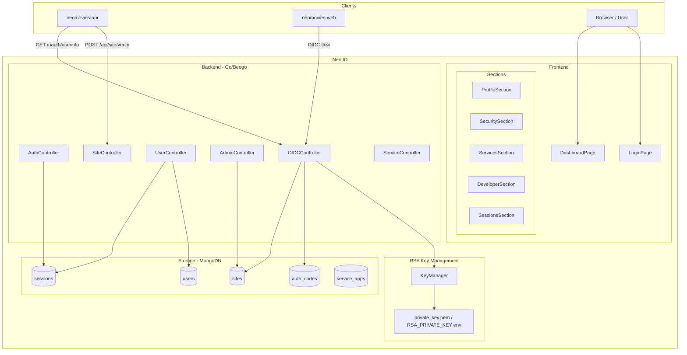

# Design Document: Neo ID OIDC Refactor

## Overview

Масштабный рефакторинг Neo ID — SSO/OIDC провайдера на Go (Beego) + React. Основные направления:

1. **Admin API для управления OIDC-клиентами** — убрать публичный `POST /api/site/register`, заменить на защищённый `POST /api/admin/clients`.
2. **Переход на RS256** — заменить HS256 на асимметричную подпись ID Token, добавить корректный JWKS endpoint.
3. **Улучшение сессий** — инвариант 10 сессий, инвалидация при смене пароля, cleanup по расписанию.
4. **Developer-friendly API** — единый формат ошибок, health endpoint, WWW-Authenticate заголовки.
5. **Рефакторинг фронтенда** — lucide-react, разбивка на компоненты-секции, удаление RegisterSitePage.
6. **Обратная совместимость** — все существующие endpoints neomovies-api продолжают работать.

---

## Architecture



### Ключевые архитектурные решения

**RS256 вместо HS256 для ID Token.** Клиенты могут верифицировать токены локально без обращения к Neo ID, используя публичный ключ из JWKS. Приватный ключ хранится в файле или переменной окружения `RSA_PRIVATE_KEY`.

**Admin-only регистрация клиентов.** Публичный endpoint `POST /api/site/register` удаляется. Управление клиентами переходит в `POST /api/admin/clients` с проверкой роли `admin`/`moderator`. Это устраняет риск несанкционированной регистрации.

**Компонентная архитектура фронтенда.** `DashboardPage` разбивается на независимые секции в `src/components/sections/`. Каждая секция — отдельный файл с собственным состоянием и API-вызовами.

---

## Components and Interfaces

### Backend

#### AdminController (новый/расширенный)

```
POST   /api/admin/clients              — создать OIDC-клиента
GET    /api/admin/clients              — список всех клиентов
DELETE /api/admin/clients/:client_id   — удалить клиента
PATCH  /api/admin/clients/:client_id   — обновить клиента
```

Все методы требуют роль `admin` или `moderator`. Middleware `requireAdmin` проверяет Bearer токен и роль.

#### OIDCController (рефакторинг)

```
GET  /.well-known/openid-configuration  — discovery (обновить alg на RS256)
GET  /.well-known/jwks.json             — JWKS с RSA публичным ключом
GET  /oauth/authorize                   — Authorization Code Flow
POST /oauth/token                       — обмен кода на токены
GET  /oauth/userinfo                    — userinfo (Bearer)
POST /oauth/revoke                      — RFC 7009
```

`generateIDToken` переписывается для использования RSA приватного ключа и `jwt.SigningMethodRS256`.

#### KeyManager (новый)

```go
type KeyManager struct {
    privateKey *rsa.PrivateKey
    kid        string
}

func NewKeyManager() (*KeyManager, error)  // загрузить или сгенерировать ключ
func (km *KeyManager) Sign(claims jwt.Claims) (string, error)
func (km *KeyManager) PublicKeyJWK() map[string]interface{}
func (km *KeyManager) Kid() string
```

Синглтон, инициализируется при старте приложения в `main.go`.

#### ServiceController (обратная совместимость)

```
POST /api/service/verify    — верификация токена с API-ключом
GET  /api/service/userinfo  — userinfo для сервисов
```

Сохраняет существующий формат ответа для neomovies-api.

#### AuthController (дополнения)

```
GET /api/health  — {"status": "ok", "version": "..."}
```

Единый формат ошибок: все контроллеры используют хелпер `respondError(c, status, code, description)`.

### Frontend

#### Структура компонентов

```
src/
  components/
    sections/
      ProfileSection.jsx
      SecuritySection.jsx
      ServicesSection.jsx
      DeveloperSection.jsx
      SessionsSection.jsx   (перенести из components/)
    ThemeToggle.jsx
    TOTPSection.jsx         (остаётся, используется внутри SecuritySection)
    EmailMFASection.jsx     (остаётся, используется внутри SecuritySection)
    AvatarPickerDialog.jsx
  pages/
    LoginPage.jsx           (заменить inline SVG на lucide-react)
    DashboardPage.jsx       (рефакторинг — делегировать в секции)
    AdminPage.jsx
    DocsPage.jsx
    ...                     (RegisterSitePage.jsx — удалить)
  api/
    client.js
    endpoints.js
```

#### DashboardPage после рефакторинга

`DashboardPage` становится тонким оркестратором: загружает профиль, передаёт данные в активную секцию. Навигация: `profile`, `security`, `services`, `developer` (без `sites`).

---

## Data Models

### OIDCClient (расширение модели Site)

Существующая модель `Site` используется как OIDC-клиент. Добавляются поля:

```go
type Site struct {
    // ... существующие поля ...
    ClientID     string   `bson:"client_id" json:"client_id"`         // = SiteID (алиас)
    ClientSecret string   `bson:"client_secret" json:"client_secret"` // = APISecret (алиас)
    RedirectURIs []string `bson:"redirect_uris" json:"redirect_uris"` // список разрешённых URI
    // OwnerID вместо OwnerEmail для нормализации
    OwnerID      string   `bson:"owner_id" json:"owner_id"`
}
```

> Решение: использовать `SiteID` как `client_id` и `APISecret` как `client_secret` для обратной совместимости. Добавить `redirect_uris []string` вместо единственного `redirect_uri string`.

### AuthCode (без изменений)

```go
type AuthCode struct {
    Code                string    `bson:"code"`
    ClientID            string    `bson:"client_id"`
    UserID              string    `bson:"user_id"`
    RedirectURI         string    `bson:"redirect_uri"`
    Scope               string    `bson:"scope"`
    Nonce               string    `bson:"nonce"`
    CodeChallenge       string    `bson:"code_challenge"`
    CodeChallengeMethod string    `bson:"code_challenge_method"`
    ExpiresAt           time.Time `bson:"expires_at"`
    Used                bool      `bson:"used"`
}
```

### Session (без изменений структуры)

Добавляется индекс по `(user_id, last_used_at)` для эффективного удаления самой старой сессии при превышении лимита 10.

### RSA Key Storage

Приватный ключ хранится в PEM-формате:
- Файл: `private_key.pem` в рабочей директории (для локальной разработки)
- Env: `RSA_PRIVATE_KEY` — PEM-строка (для production/Vercel)

При старте: если `RSA_PRIVATE_KEY` задана — использовать её; иначе попытаться загрузить файл; иначе сгенерировать новый ключ RSA-2048 и сохранить в файл.

---

## Correctness Properties

*A property is a characteristic or behavior that should hold true across all valid executions of a system — essentially, a formal statement about what the system should do. Properties serve as the bridge between human-readable specifications and machine-verifiable correctness guarantees.*

### Property 1: Уникальность client_id при создании клиентов

*For any* набора из N вызовов создания OIDC-клиента с валидными payload, все возвращённые `client_id` должны быть попарно уникальны.

**Validates: Requirements 1.2**

---

### Property 2: Round-trip создания и удаления клиента

*For any* созданного OIDC-клиента, после его удаления через `DELETE /api/admin/clients/:client_id`, клиент не должен присутствовать в ответе `GET /api/admin/clients`.

**Validates: Requirements 1.4**

---

### Property 3: Round-trip обновления клиента

*For any* OIDC-клиента и любого валидного набора полей (`name`, `redirect_uris`, `logo_url`), после `PATCH /api/admin/clients/:client_id` последующий `GET /api/admin/clients` должен возвращать обновлённые значения.

**Validates: Requirements 1.5**

---

### Property 4: Валидация обязательных полей при создании клиента

*For any* запроса на создание клиента, в котором отсутствует хотя бы одно из обязательных полей (`name` или `redirect_uris`), сервер должен возвращать HTTP 400.

**Validates: Requirements 1.6**

---

### Property 5: Инвалидация Auth_Code при удалении клиента

*For any* OIDC-клиента с активными Auth_Code, после удаления клиента попытка использовать любой из этих кодов на `/oauth/token` должна возвращать ошибку `invalid_grant`.

**Validates: Requirements 1.8**

---

### Property 6: kid в ID_Token совпадает с JWKS

*For any* выданного ID_Token, значение `kid` в заголовке токена должно совпадать с `kid` одного из ключей в ответе `GET /.well-known/jwks.json`.

**Validates: Requirements 2.3, 7.4**

---

### Property 7: ID_Token подписан RS256

*For any* выданного ID_Token, алгоритм подписи в заголовке (`alg`) должен быть `RS256`, и токен должен успешно верифицироваться публичным ключом из JWKS.

**Validates: Requirements 2.10, 7.2**

---

### Property 8: Обязательные claims в ID_Token

*For any* выданного ID_Token с любым `nonce`, декодированный payload должен содержать поля `iss`, `sub`, `aud`, `exp`, `iat`, и `nonce` (если был передан в запросе).

**Validates: Requirements 2.11**

---

### Property 9: Защита от replay-атак (повторное использование Auth_Code)

*For any* Auth_Code, который уже был успешно использован для получения токенов, повторная попытка обмена на `/oauth/token` должна возвращать ошибку `invalid_grant`.

**Validates: Requirements 2.12**

---

### Property 10: PKCE S256 верификация

*For any* `code_verifier` (случайная строка), вычисленный `code_challenge = BASE64URL(SHA256(verifier))` должен успешно проходить верификацию на `/oauth/token` при использовании метода `S256`.

**Validates: Requirements 2.9**

---

### Property 11: Инвариант количества сессий (не более 10)

*For any* пользователя, после создания более 10 сессий, количество активных сессий в БД не должно превышать 10, а самая старая по `last_used_at` должна быть удалена.

**Validates: Requirements 3.9**

---

### Property 12: Инвалидация сессий при смене пароля

*For any* пользователя с N активными сессиями, после смены пароля из одной из них, все остальные N-1 сессий должны возвращать HTTP 401 при попытке использования.

**Validates: Requirements 3.8**

---

### Property 13: Round-trip отзыва сессии

*For any* активной сессии, после её отзыва через `POST /api/user/sessions/revoke`, попытка использовать соответствующий `access_token` или `refresh_token` должна возвращать HTTP 401.

**Validates: Requirements 3.6**

---

### Property 14: Формат ошибок

*For any* запроса, возвращающего HTTP 4xx или 5xx, тело ответа должно содержать JSON с полями `error` (строка-код) и `error_description` (человекочитаемое описание).

**Validates: Requirements 4.1**

---

### Property 15: Верификация токена через /api/service/verify (обратная совместимость)

*For any* валидного `access_token` и соответствующего API-ключа клиента, `POST /api/site/verify` должен возвращать HTTP 200 с `{"valid": true, "user": {"unified_id": ..., "email": ..., "display_name": ..., "avatar": ...}}`.

**Validates: Requirements 6.1, 6.6**

---

### Property 16: Видимость раздела Developer по роли

*For any* пользователя с ролью `developer`, `admin` или `moderator`, раздел "Developer" должен отображаться в Dashboard. *For any* пользователя с любой другой ролью, раздел "Developer" не должен отображаться.

**Validates: Requirements 5.5**

---

## Error Handling

### Единый формат ошибок

Все API-ответы с ошибками используют структуру:

```json
{
  "error": "<machine_readable_code>",
  "error_description": "<human_readable_message>"
}
```

Хелпер в Go:

```go
func respondError(c *web.Controller, status int, code, description string) {
    c.Ctx.ResponseWriter.WriteHeader(status)
    c.Data["json"] = map[string]interface{}{
        "error":             code,
        "error_description": description,
    }
    c.ServeJSON()
}
```

### OIDC-специфичные ошибки

| Ситуация | HTTP | error code |
|---|---|---|
| Невалидный client_id | 400 | `invalid_client` |
| Невалидный redirect_uri | 400 | `invalid_request` |
| Истёкший/использованный auth_code | 400 | `invalid_grant` |
| Невалидный client_secret | 401 | `invalid_client` |
| Невалидный/истёкший access_token | 401 | `invalid_token` |
| Недостаточно прав | 403 | `access_denied` |

### WWW-Authenticate заголовок

При HTTP 401 на защищённых endpoints:

```
WWW-Authenticate: Bearer realm="neo-id", error="invalid_token", error_description="..."
```

### RSA Key Manager — ошибки при старте

Если ключ не может быть загружен и не может быть сгенерирован — приложение завершается с `log.Fatal`. Это fail-fast поведение предпочтительнее, чем работа без подписи токенов.

---

## Testing Strategy

### Unit Tests

Тестируют конкретные функции и edge cases:

- `verifyCodeChallenge(verifier, challenge, method)` — S256 и plain
- `generateIDToken(user, site, nonce)` — наличие claims, алгоритм RS256
- `KeyManager.PublicKeyJWK()` — корректная структура JWK
- Валидация `redirect_uri` против списка разрешённых
- Формат ошибок `respondError`
- Логика ограничения 10 сессий

### Property-Based Tests

Используется библиотека **[`pgregory.net/rapid`](https://github.com/pgregory/rapid)** для Go.

Каждый property test запускается минимум **100 итераций**.

Тег формата: `// Feature: neo-id-oidc-refactor, Property N: <text>`

| Property | Что генерируется | Что проверяется |
|---|---|---|
| P1: Уникальность client_id | N случайных payload для создания клиентов | Все client_id уникальны |
| P2: Round-trip удаления | Случайный клиент | После удаления отсутствует в списке |
| P3: Round-trip обновления | Клиент + случайные новые поля | GET возвращает обновлённые значения |
| P4: Валидация полей | Запросы с отсутствующими полями | HTTP 400 |
| P5: Инвалидация кодов | Клиент + auth_code | После удаления клиента код невалиден |
| P6: kid совпадение | Любой пользователь + клиент | kid в токене ∈ JWKS |
| P7: RS256 подпись | Любой пользователь + клиент | alg=RS256, верификация публичным ключом |
| P8: Claims в ID_Token | Пользователь + nonce (опционально) | Все обязательные claims присутствуют |
| P9: Replay protection | Auth_code | Второй обмен → invalid_grant |
| P10: PKCE S256 | Случайный code_verifier | BASE64URL(SHA256(v)) проходит верификацию |
| P11: Лимит сессий | >10 логинов одного пользователя | Сессий ≤ 10, самая старая удалена |
| P12: Инвалидация при смене пароля | N сессий + смена пароля | N-1 сессий → 401 |
| P13: Round-trip отзыва | Активная сессия | После revoke → 401 |
| P14: Формат ошибок | Различные невалидные запросы | Всегда {error, error_description} |
| P15: /api/site/verify | Валидный токен + API-ключ | valid:true + поля пользователя |
| P16: Видимость Developer | Пользователи с разными ролями | Раздел виден/скрыт по роли |

### Integration Tests

- Cleanup истёкших сессий (scheduled job)
- Popup-режим с postMessage
- Ротация RSA ключей (оба ключа в JWKS в течение 24 часов)
- `GET /api/site/callback` — корректный редирект с токеном

### Smoke Tests

- `GET /api/health` → `{"status": "ok"}`
- `POST /api/site/register` → 404 (маршрут удалён)
- CORS заголовки на `/oauth/token` и `/.well-known/*`
- RSA ключ генерируется при старте без `RSA_PRIVATE_KEY`
- `RSA_PRIVATE_KEY` env используется если задана
- lucide-react установлен и импортируется в компонентах
